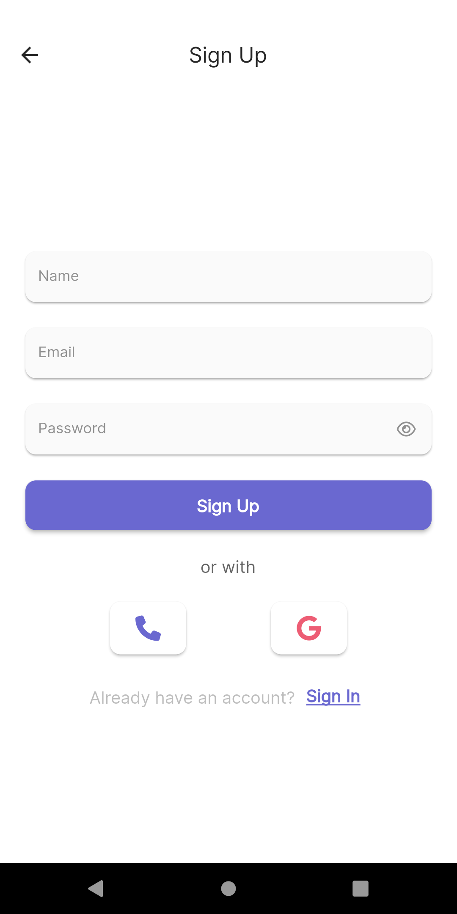
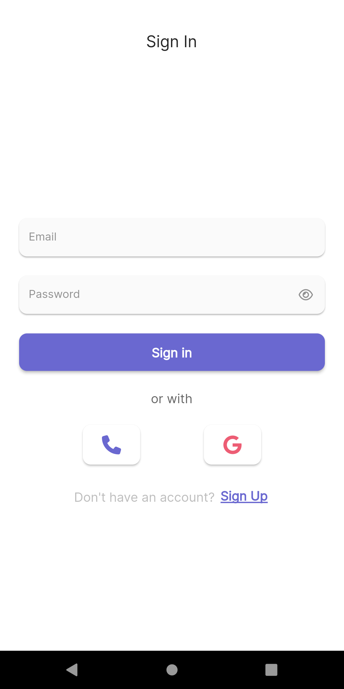
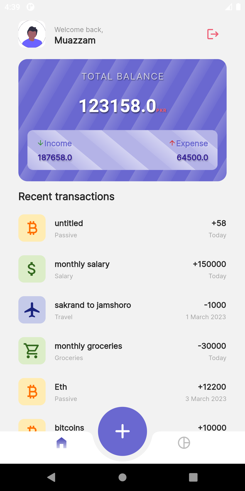
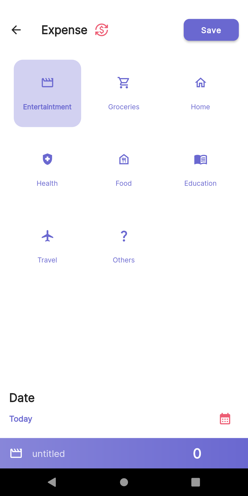
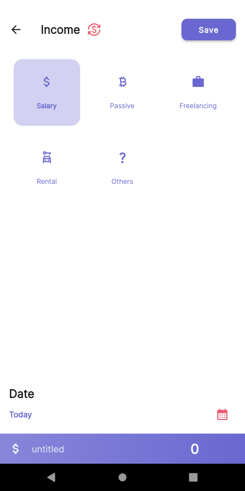
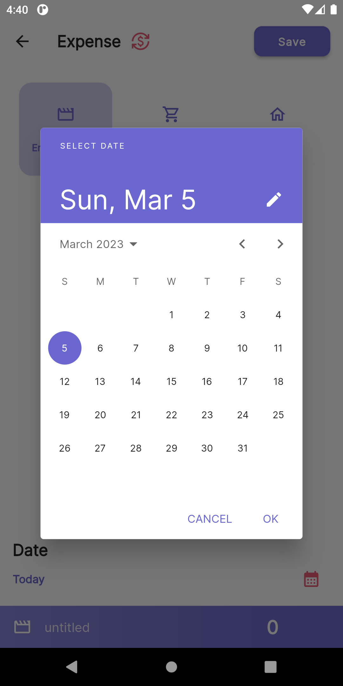
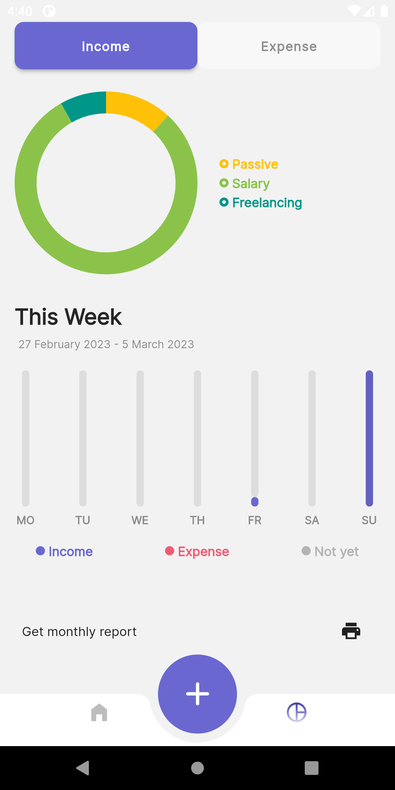
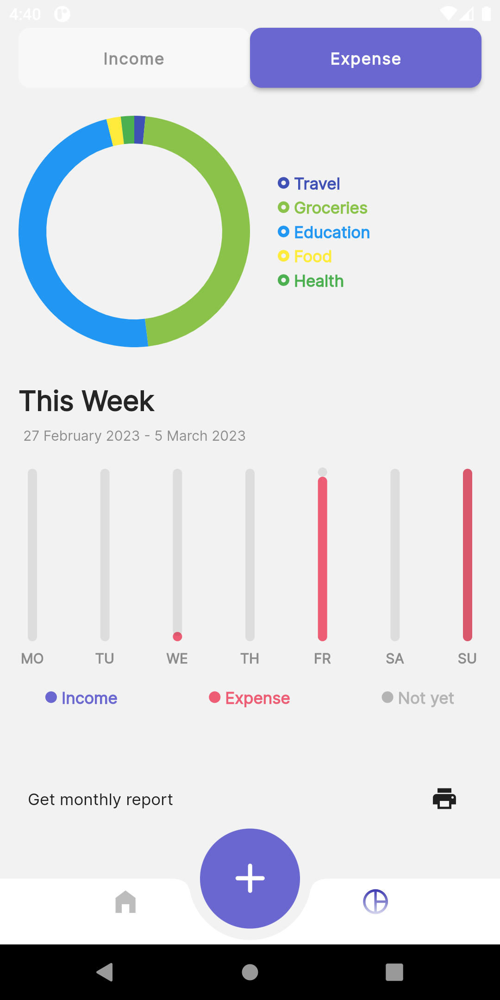
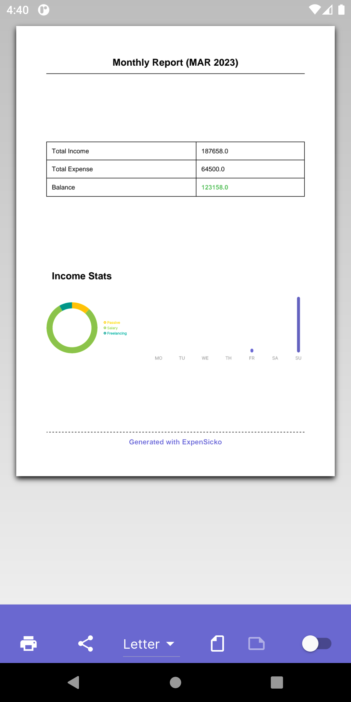
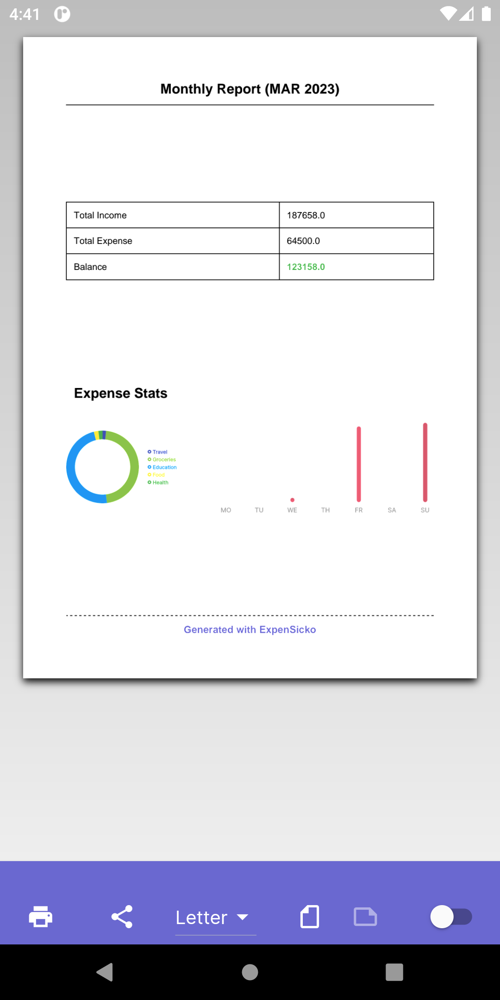

# Expense Tracker with Flutter & Firebase

## Screenshots:
### Onboarding Screens:

### Auth Screens:

### Home Screen:

### Add Transaction:

### Stats Screen:

### Generate Monthly report:

## Design Inspo:
[Dribble](https://dribbble.com/shots/14356673-Money-Management-App/attachments/6023247?mode=media)

## Most Useful Packages used in this project: 
- pdf
- screenshot
- fl_chart
- pin_put